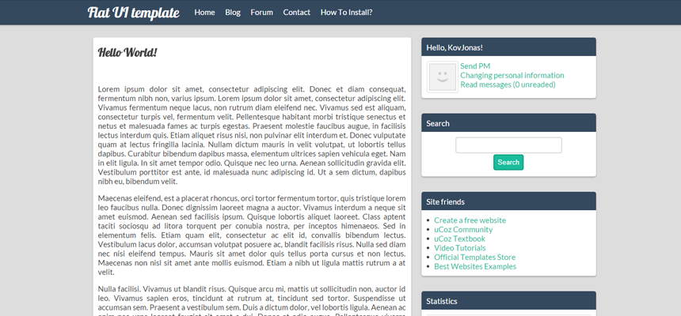

# Flat UI stílusú webdesign

Egy modern, egyszerű, univerzális sablon, mely a Flat UI standardjait használja.

1. lépés:

FTP használatával töltsd fel az uCoz tárhelyedre az img mappa tartalmát (vagy Használd az uCoz saját fájlfeltöltőjét: új mappa -> img, majd töltsd fel az img mappa tartalmát).

2. lépés:

Vezérlőpult -> Honlap-stílus -> Külalak vezérlése (CSS), és másold be a style.css fájl tartalmát, majd kattints a Mentés gombra!

3. lépés:

Menj a Vezérlőpult -> Honlap-stílus -> Külalak vezérlése (sablonok) -> Sablonok szerkesztője menüpontra, másold be a tmpl.txt fájl tartalmát, majd kattints a Mentés gombra.

4. lépés:

Menj a Vezérlőpult -> Honlap-stílus -> Külalak vezérlése (sablonok) -> első contanier menüpontra, majd a user-block.txt fájl tartalmát másold be oda, ahol a felhasználó profiljának adatait megjelenő blokkot szeretnéd látni.

5. lépés:

Élvezd az új uCoz sablonod!

*(by KovJonas)*
