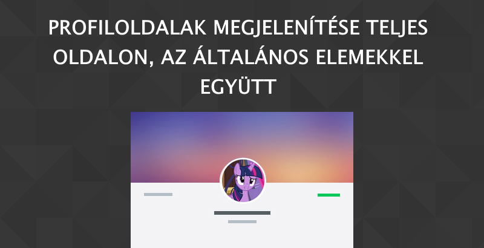
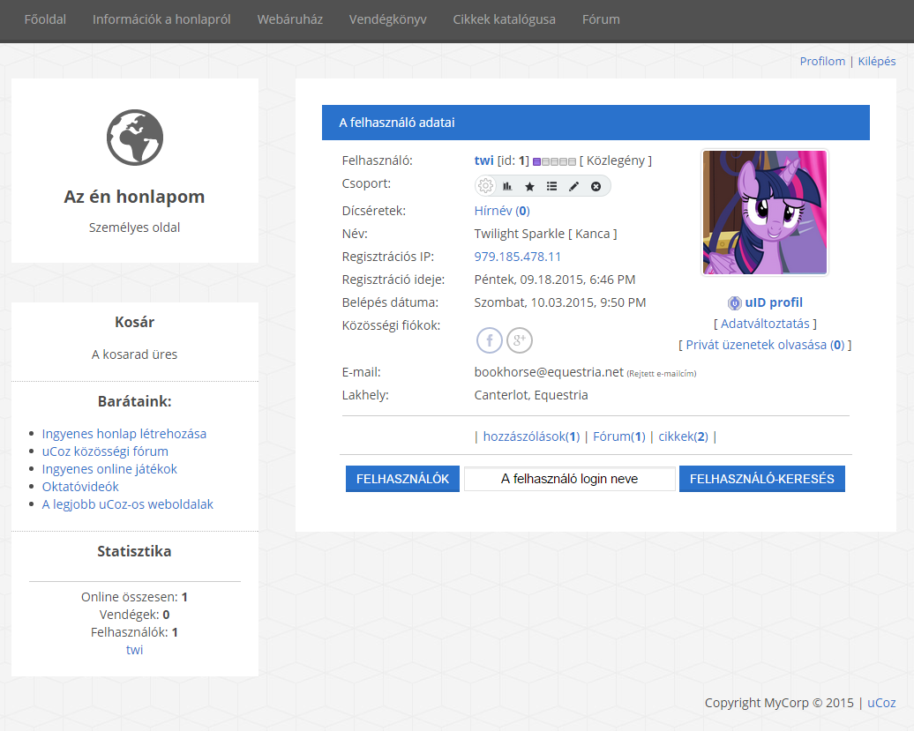
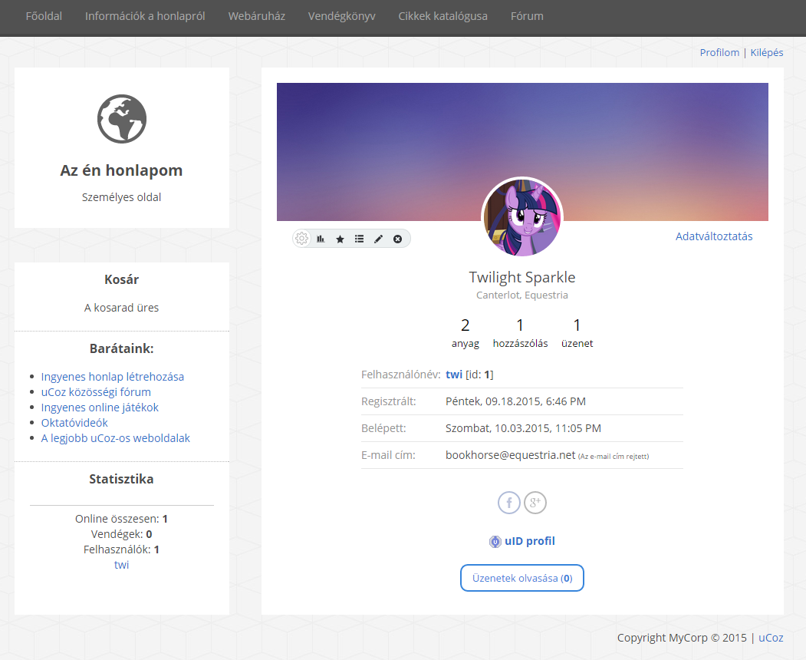

# Profiloldal kinézet teljes oldalon, az általános elemekkel együtt



Ebben a cikkben megtudjuk, hogyan készíthetünk egy teljes oldalon megjelenő profiloldalt, a weboldal további általános elemeivel.

Sokan kérdezték már azt, hogy hogyan lehet úgy megcsinálni a profiloldalakat, hogy azok teljes oldalon jelenjenek meg úgy, hogy közben az oldal többi általános része is megjelenik.

Fontos, hogy a **Felhasználók** modul beállításaiban a **Felhasználó személyes oldalának megnyitása** opciónál az **Ebben az ablakban** elem legyen kiválasztva.

Ha ez megvan, a következőkben három Vezérlőpultos fül kell legyen megnyitva:

 - Külalak szerkesztése » A felhasználó saját oldala
 - Külalak szerkesztése » A felhasználó saját oldala (igen, még egyszer)
 - Külalak szerkesztése » A honlap oldalai

Fontos, hogy ne keverjük össze - csak az elsőben végzünk módosításokat.

1. Másoljuk ki **A honlap oldalai** sablon tartalmát a harmadik fülről, majd cseréljük le az első fülön levő **Felhasználó saját oldala** sablon tartalmát a kimásolt kódra, de még ne mentsük.

2. Másoljuk ki a második fülben levő Felhasználó saját oldala sablon, `<body>` és `</body>` közötti kódját (az előbb említett kódok kimásolása nélkül), majd illesszük be az első fülben található sablonba, a `$CONTENT$` változó helyébe.

Kész is! 



## Vadonatúj, modern stílus

Szeretnél egy remek, modern stílust kölcsönözni az oldalnak? Jó helyen jársz!

Csak cseréld le a `$CONTENT$` kódot, vagy a **Felhasználó saját oldala** alap kódját a következőre: 

```html
<script type="text/javascript">
if (window.name.length>2){window.resizeTo(750,420);}
function uSocialConnect(obj){
  var social = obj.id.split('-')[1];
  obj = $(obj);
  if(obj.hasClass('is-connected')){
  if(confirm('Biztosan eltávolítod a fiókból?')){
  obj.addClass('wait');
  _uPostForm('',{type:'POST',url:'/index/sub/', data:{a:4,s:social}});
  }
  }else if(!obj.hasClass('wait')){
  uSocialLogin(social);
  }
  return false;
}
</script>
<style type="text/css">  
  .social-accounts { padding:10px 0 3px }  
  .social-accounts a { opacity:.4 }  
  .social-accounts .is-connected { opacity:1!important }  
  .social-accounts .wait i { background:url(/.s/img/icon/ajsml.gif) no-repeat center center!important }  
  .social-accounts a.cursor-default, .social-accounts a.cursor-default i { cursor:default!important }  
  .statusOffline {color:#979797}  
  .statusOnline {color:#5ac92e}  

.sc-over {padding:0px 20px}  
.sc-cover {background:url('https://wallpaperscraft.com/image/spots_background_light_blur_68629_1920x1080.jpg') #1d1d1d;background-size:cover;position:relative;height:180px;margin-bottom:60px}  
.sc-cover-in {width:100%;position:absolute;left:0px;bottom:-50px;}  
.sc-avatar {width:100px;height:100px;margin:0px auto}  
.sc-avatar {border:4px solid #fff}  
.sc-avatar img {width:100px;height:100px;object-fit:cover}  
.sc-avatar, .sc-avatar img {-webkit-border-radius: 100px;-moz-border-radius: 100px;border-radius: 100px;}  
.sc-top {text-align:right;padding:15px 0px;position:absolute;bottom:-50px;left:20px;right:20px;z-index:2}  
.sc-group {float:left}  
.sc-name {font-size:19px}  
.sc-city {font-size:13px;color:#959595}  
.sc-counter, .sc-counter:hover {display:inline-block;font-size:21px;padding:15px 7px;color:#000;text-decoration:none}  
.sc-counter span {display:block;font-size:13px;}  
.sc-tabs {max-width:420px;text-align:left;font-size:14px;border-bottom:1px solid rgba(0,0,0,0.1);padding-bottom:7px;margin:7px auto}  
.sc-tabs div {float:left;width:110px;color:#959595}  
.sc-bottom, .sc-button {padding:10px 0px}  
.sc-button a, .sc-button a:hover {padding:7px 14px;font-size:13px;border:2px solid #3785dc;color:#3785dc;text-decoration:none;display:inline-block;-webkit-border-radius: 10px;-moz-border-radius: 10px;border-radius: 10px;}  
</style>  

<div class="sc-cover">  
<div class="sc-cover-in">  
  <div class="sc-avatar"><?if($_AVATAR$)?>" alt="" /><?else?><?endif?></div>  
</div>  
<div class="sc-top">  
<div class="sc-group"><?if($MODER_PANEL_RIGHT$)?>$MODER_PANEL_RIGHT$<?else?>$_GROUP_NAME$<?endif?></div>  
<div class="sc-status"><?if($_CHANGE_DETAILS_URL$)?><a href="$_CHANGE_DETAILS_URL$">Adatváltoztatás</a><?else?><?if($_STATUS$)?>$_STATUS$<?endif?><?endif?></div>  
</div>  
</div>  

<div class="sc-over" align="center">  
<div class="sc-name"><?if($_NAME$)?>$_NAME$<?else?>$_USERNAME$<?endif?></div>  
<div class="sc-city"><?if($_COUNTRY$)?>$_COUNTRY$<?endif?><?if($_CITY$)?><?if($_COUNTRY$)?>, <?endif?>$_CITY$<?endif?></div>  

<div class="sc-counters">  
<a href="$_PUBL_ACTIVITY_URL$" class="sc-counter">$_PUBL_ENTRIES$ <span>anyag</span></a>  
<a href="$_COM_ACTIVITY_URL$" class="sc-counter">$_COM_ENTRIES$ <span>hozzászólás</span></a>  
<a href="$_FORUM_ENTRIES$" class="sc-counter">$_FORUM_ENTRIES$ <span>üzenet</span></a>  
</div>  

<div class="sc-tabs"><div>Felhasználónév:</div> <a href="javascript://" rel="nofollow" onclick="prompt('A felhasználó profiljának URL-címe','$_PROFILE_URL$')"><b>$_USERNAME$</b></a> <?if($MODER_PANEL$)?>[id: <b>$_USER_ID$</b>]<?endif?></div>  
<?if($_REG_TIME$)?><div class="sc-tabs"><div>Regisztrált:</div> $_REG_TIME$</div><?endif?>  
<?if($_LOG_TIME$)?><div class="sc-tabs"><div>Belépett:</div> $_LOG_TIME$</div><?endif?>  

<?if($_WWW$)?><div class="sc-tabs"><div>Weboldal:</div> $_WWW$</div><?endif?>  
<?if($_AOL$)?><div class="sc-tabs"><div>AOL:</div> $_AOL$</div><?endif?>  
<?if($_ICQ$)?><div class="sc-tabs"><div>ICQ:</div> $_ICQ$</div><?endif?>  
<?if($_MSN$)?><div class="sc-tabs"><div>MSN:</div> $_MSN$</div><?endif?>  
<?if($_YAHOO$)?><div class="sc-tabs"><div>Yahoo:</span> $_YAHOO$</div><?endif?>  
<?if($_PHONE$)?><div class="sc-tabs"><div>Telefonszám:</div> $_PHONE$  
<?if($_IS_OWN_PROFILE$ || $MODER_PANEL$)?><?if($_PHONE_IS_HIDDEN$)?><span style="font-size:7pt">(A telefonszám rejtett)</span><?endif?><?endif?></div><?endif?>  

<div class="sc-tabs"><div>E-mail cím:</div> <?if($_IS_OWN_PROFILE$)?>$_EMAIL$  
  <?if($_EMAIL_IS_HIDDEN$)?><span style="font-size:7pt">(Az e-mail cím rejtett)</span><?endif?>  
<?else?>  
  <?if($MODER_PANEL$)?><a href="mailto:$_EMAIL$">$_EMAIL$</a>  
  <?if($_EMAIL_IS_HIDDEN$)?><span style="font-size:7pt">(Az e-mail cím rejtett)</span><?endif?>  
  <?if(!$_EMAIL_IS_VERIFIED$)?><span style="color:red;" title="Az e-mail cím nincs megerősítve">*</span><?endif?>  
  <?else?>  
  <?if($_SEND_EMAIL_URL$)?><a href="$_SEND_EMAIL_URL$">E-mail küldése a felhasználónak</a>  
  <?else?>$_EMAIL$  
  <?endif?>  
<?endif?>  
<?endif?>  
<?if($_EMAIL_VERIFICATION_URL$)?>[ <b><a href="$_EMAIL_VERIFICATION_URL$"><span style="color:red">E-mail cím megerősítése</span></a></b> ]<?endif?>  
</div>  

<?if($_SIGNATURE$)?><div class="sc-tabs"><div>Aláírás:</div> $_SIGNATURE$</div><?endif?>  

<?if($SOCIAL_LOGIN$)?><div class="sc-bottom"><div class="social-accounts">$_SOCIAL_ACCOUNTS$</div></div><?endif?>  
<?if($_UID$)?><div class="sc-bottom"> <a href="$_UID_URL$" target="_blank"><b>uID profil</b></a></div><?endif?>  
<div class="sc-button"><?if($_PM_READ_URL$)?><a href="$_PM_READ_URL$">Üzenetek olvasása (<b>$UNREAD_PM$</b>)</a><?endif?><?if($_PM_SEND_URL$)?><a href="$_PM_SEND_URL$">Privát üzenet küldése</a><?endif?>  
</div>  
</div>
```



*Forrás: http://yraaa.ru/templates/personalnaya-stranica-dlya-ucoz, a uCoz Táskán közzétette Irina Pushina*