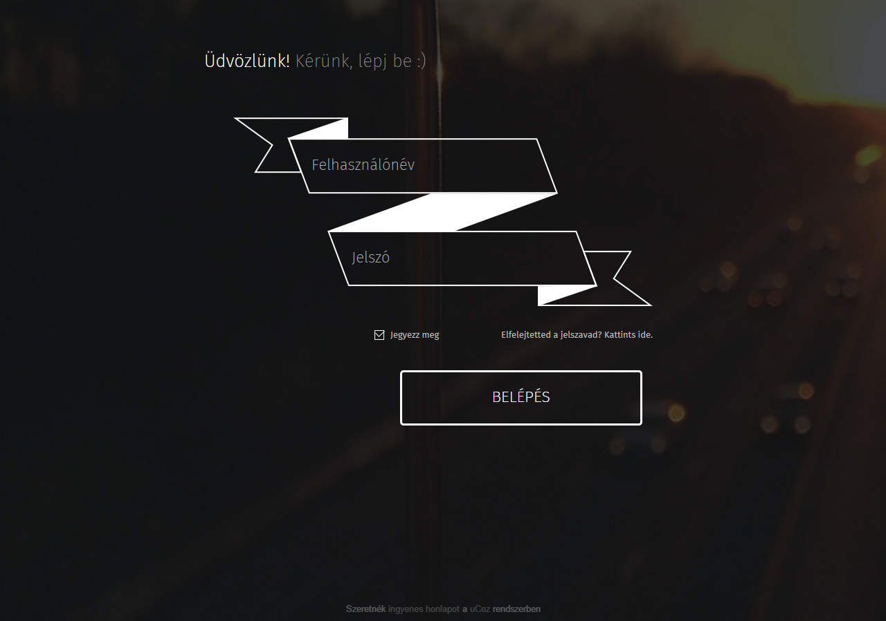

# Új belépési űrlap stílus

[](https://mega.nz/#!TdthAIzZ!4plxiyNW_ClAxV522Y8lzg1Q8K3m_ykKneGArzhq1Mc)

Ma egy modern, egyszerű, de nagyszerű kinézetű belépési űrlapot hozunk el uCoz-os weboldalaitokra!

Figyelem! Ez csak akkor működik, ha a Felhasználók modul beállításaiban a **Régi belépési űrlap** van kiválasztva.



1. Töltsd fel az archívumban található mappát a tárhelyre.

2. A **Felhasználók belépési oldala** sablon tartalmát cseréld erre: 

```html
<!DOCTYPE html>
<html>
<head>
<meta charset="utf-8">
<title>Belépés - $SITE_NAME$</title>
<link rel="stylesheet" type="text/css" href="/login-page/style.css">
<noscript><link rel="stylesheet" type="text/css" href="/_st/my.css"></noscript>
</head>
<body class="background">
  <h1 class="welcome"><span>Üdvözlünk!</span> Kérünk, lépj be  </h1>
$BODY$
  <div class="powered-by">$POWERED_BY$</div>
</body>
</html>
```

3. A **Felhasználók belépése** sablon tartalmát pedig erre: 

```html
<?if($PAGE_ID$="login")?>
<div class="login-form">
<div class="input-box">
<div><input class="user" autocomplete="off" placeholder="Felhasználónév" type="text" name="user" size="20" maxlength="50"/></div>
<div><input class="password" autocomplete="off" placeholder="Jelszó" type="password" name="password" size="20" maxlength="15"/></div>
</div>
<div class="function">
<div class="checkbox"><input id="rem$PAGE_ID$" type="checkbox" name="rem" value="1" checked="checked"/><label for="rem$PAGE_ID$"><span></span>Jegyezz meg</label></div>
<a class="forgot-your-password" href="$REMINDER_LINK$">Elfelejtetted a jelszavad? Kattints ide.</a>
</div>
<input class="loginButton" name="sbm" type="submit" value="BELÉPÉS"/>
</div>
<?else?>
<table border="0" cellspacing="1" cellpadding="0" width="100%">
<?if($ERROR$)?><td colspan="2" style="color:red;text-align:center;">$ERROR$</td><?endif?>
<tr><td width="20%" nowrap="nowrap">E-mail: $UID_ICON$</td><td><input class="loginField" type="text" name="user" value="" size="20" style="width:100%;" maxlength="50"/></td></tr>
<tr><td>Jelszó:</td><td><input class="loginField" type="password" name="password" size="20" style="width:100%" maxlength="15"/></td></tr>
</table>
<table border="0" cellspacing="1" cellpadding="0" width="100%">
<tr><td nowrap><input id="rem$PAGE_ID$" type="checkbox" name="rem" value="1" checked="checked"/><label for="rem$PAGE_ID$">megjegyez</label> <?if($PAGE_ID$="login" && $HIDDEN_ALLOWED$)?>
<input id="hid$PAGE_ID$" type="checkbox" name="hidden" value="1" /><label for="hid$PAGE_ID$">rejtett</label><?endif?></td><td align="right" valign="top"><input class="loginButton" name="sbm" type="submit" value="Belépés"/></td></tr>
<tr><td colspan="2"><div style="font-size:7pt;text-align:center;"><a href="$REMINDER_LINK$">Elfelejtett jelszó</a> | <a href="$REGISTER_LINK$">Regisztráció</a></div></td></tr>
</table>
<?endif?>
```

Az oldalra vezető link **http://oldalad.ucoz.hu/index/1**. 
